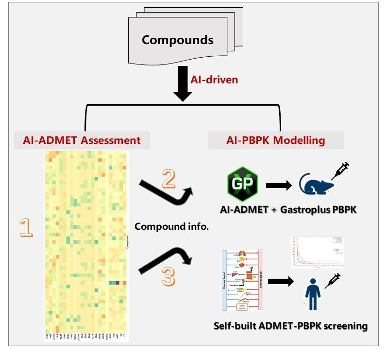

# GenMAS: An Artificial Intelligence-Driven Pharmacokinetics Modelling and Assessment Strategy Incorporating ADMET and PBPK

**Our Group**: Yaxin Gu†, Peng Qi†, Lingling Ma, Guodong Zhang*, Biao Lu, Fanglong Yang, Haizhou Zhang  
**Affiliation**: Changchun Genescience Pharma  
**Last Update**: June 2025

---

## 📝 Abstract

This project proposes **GenMAS**, a novel AI-driven modeling and assessment strategy aimed at advancing animal alternative in pharmacokinetics through the integration of ADMET property prediction and PBPK modeling.

We demonstrate the effectiveness of our method on case studies:
- **[AI-ADMET prediction]**: Validation on internal and external data sets.
- **[AI-PBPK modeling]**: Commercial software and self-built high-throughput PBPK model.



---

## ✨ Key Features

- **Innovation**: Combines machine learning-based ADMET prediction with commercial & high-throughput PBPK simulations
- **Efficiency**: Supports rapid parameter estimation and scalable model inference
- **Scalability**: Adaptable across species, endpoints, and drug types

---

## 🚀 Getting Started

### 📦 Environment Setup

We recommend using `conda`:

```bash
# Create and activate a virtual environment
conda create -n genmas_env python=3.8
conda activate genmas_env

# Install dependencies
numpy(1.24.3)
pandas(2.0.3)
scipy(1.10.1)
rdkit(2024.3.5)
scikit-learn(1.3.2)
```

---
### 📁 Project Structure Overview
```text
GenMAS/
├── Data/                     # Input datasets for three case studies
├── Models/                   # Machine learning and PBPK model implementations
├── Scripts/                  # Training, evaluation, and simulation scripts
├── img/                      # workflow fig
├── README.md                 # Project description and instructions
```
---

## ▶️ Running the Code
### 1. AI-ADMET Property Prediction
ADMET models in the GenMAS are available in：https://figshare.com/articles/journal_contribution/ADMET_Models_of_GenMAS/29312867
```bash
python Scripts/ADMET_Model.py
python Scripts/ADMET_Predict.py
```
---

### 2. AI-PBPK Parameter Estimation
Self-built PBPK model is available at Models/
```bash
python Scripts/GenMAS_IV_PBPK.py
```


